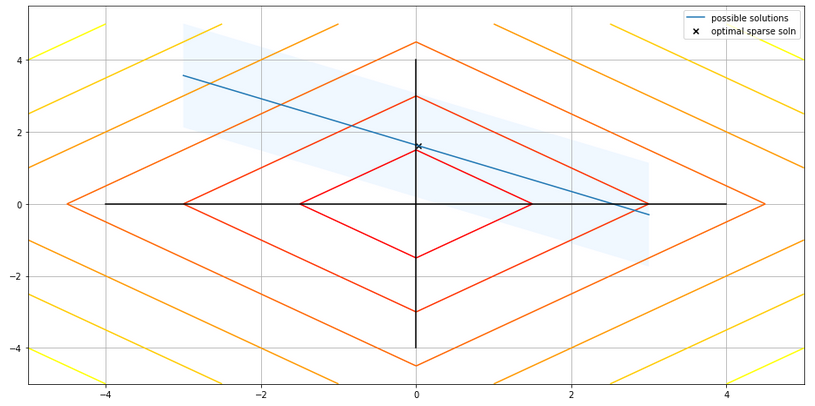
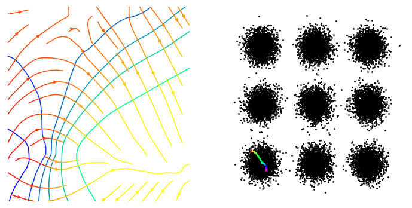
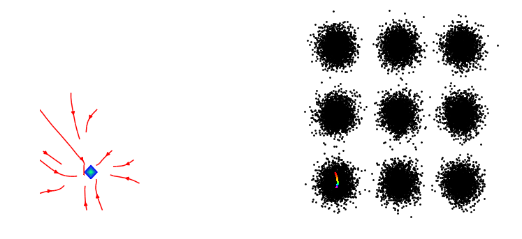
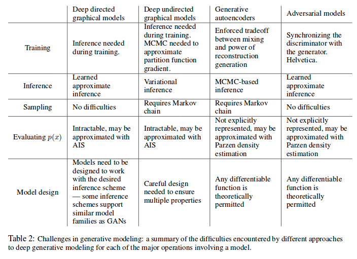
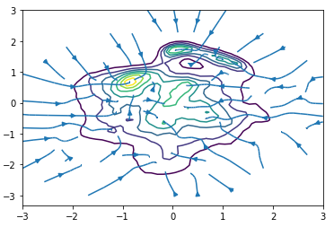

## Compressed sensing

Started with attempting to get familiar with compressed sensing.

A couple of great resources ...

#### Future directions

I also wonder if it is possible to regularise neural networks to be mutually incoherent and what this could achieve.

## Learned priors

Three alternatives were explored. VAEs, GANS and RIMs.

#### [GANs](https://papers.nips.cc/paper/5423-generative-adversarial-nets.pdf)

A simple 2d GAN. The generator takes a 1D noise signal and maps it into a 2D space. The goal is to learn to generate samples from P(x). However, the infamous model collapse problem is present.

At initialisation, the gradients don't point anywhere useful and the generator has been initialised spanning one of the modes.

Unless the mode collapse problem can be reliably solved (with guarantees), GANs are not a good idea.

Rather than push a reconstruction towards P(X) it will push it towards its model of P(X) which ...!?

Large amount of existing prior work here, see [reading.md](reading.md).

#### VAEs

$$
\begin{align}
p(x) &= E_{z\sim p(z)} p(x \mid z)  \\
p(x | z) &= \frac{p(z \mid x)p(x)}{p(z)}  \\
&\approx E_{x \sim D}  p(z \mid x)p(x) \\
\end{align}
$$

Intuition, the most common inputs to a VAE get mapped to the center of the gaussian distribution.
Bc its non convex, there are no guarantees? But is it the global minima?

#### RIMs

The code for RIMs exists in [src](src), but it will take some effort to reproduce the papers results.

## Density models

The deeper problem is that we want to use the density of X to help us reconstruct images. Yet we dont have any good models of density...

#### Parzen windows

$$
p(x) = \frac{1}{n}\sum_{i=0}^n k(x, \hat x_i)
$$

So while the gradients (which is what we want to use) will point in meaningful directions...

Not just point to the nearest data point.

This representation will probably lead to low generalisation.
From the image we can see that the whole space is totally shattered.

#### Future directions

Could try playing with [Gaussian processes](https://en.wikipedia.org/wiki/Gaussian_process) or [Neural processes](https://arxiv.org/abs/1807.01622).
Or look into information geometry to ...?

## Safe reconstruction

$$
\mathop{\text{argmin}}_x \parallel \phi(x) \parallel_1 \text{ s.t. } \parallel f(x) - y\parallel_2 < \epsilon \\
\mathop{\text{argmin}}_x \parallel \phi(x) \parallel_1 + \lambda \parallel f(x) - y\parallel_2 \\
$$

But what value of $\lambda$ should be chosen? it depends of $\epsilon$ and the amount of noise in the sampling process, $f$.

We want to pick $\lambda$ so that no progess on $\parallel f(x) - y \parallel_2$ is sacrificed.
But if you are too strict then the may end p reconstructing noise...!?
